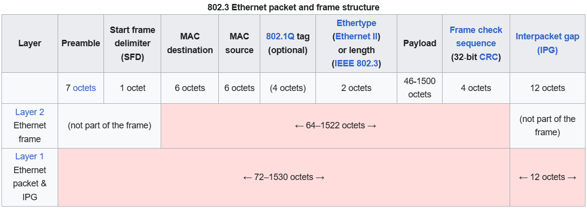
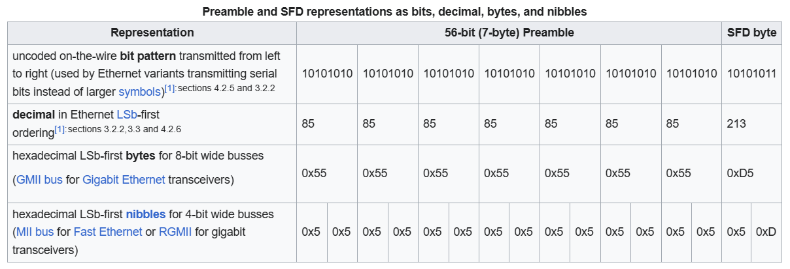
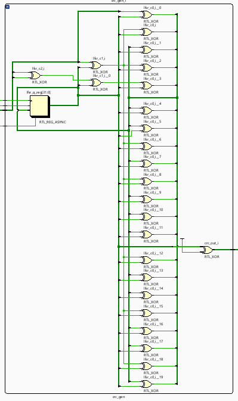
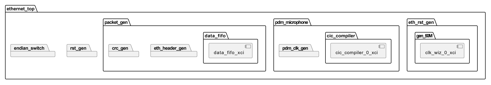
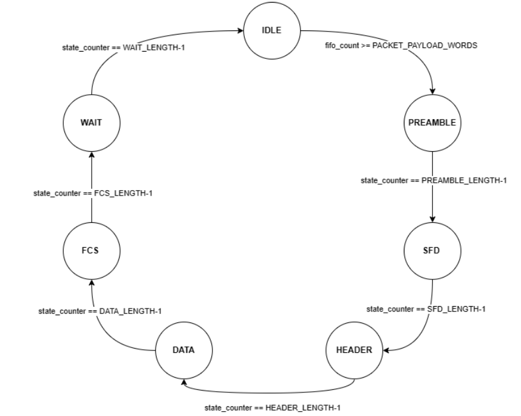

# Implementation

## The 5-Layer TCP/IP Model

The TCP/IP model is a conceptual framework used in network communications, describing how data should be formatted, addressed, transmitted, routed, and received at the destination. Originally developed by the Defense Advanced Research Projects Agency (DARPA), this model forms the basis of the Internet.

1. PHYSICAL LAYER
2. DATA-LINK LAYER
3. NETWORK LAYER
4. TRANSPORT LAYER
5. APPLICATION LAYER

### Physical Layer

- Transmits raw bits over the physical medium
- Category 5 (Cat 5) or higher unshielded twisted pair (UTP) cables
- It follows the 10 Base T or IEEE 802.11 architecture.
- Specifies the speed of data transmission (Data rate)
- Ensures sender and receiver clocks are synchronized

#### 100BASE-TX

- 100BASE-TX is part of the IEEE 802.3u standard (Fast Ethernet)
- Designed to run over twisted pair cables
- Two twisted paris for transmission and reception
- Transmission rate of 100 megabits per second (Mbps) over half and full duplex modes

### Data Link Layer

- Packages data into frames for transmission (Encapsulation)
- Unique addresses to devices using MAC (48 bits)
- Ethernet and Wi-Fi Common technologies
- Data Link Protocols Includes Ethernet and Wi-Fi

#### Ethernet frame (802.3)

The Ethernet header is a crucial part of network communications, containing several fields that facilitate the correct delivery and processing of data. Let's delve into each field of the Ethernet header.

##### 1. The Preamble Field

- **Length**: 7 bytes.
- **Function**: Facilitates the identification of the beginning of an Ethernet frame.
- **Pattern**: Each byte alternates between 1 and 0, forming the pattern `10101010`.
- **Purpose**: Helps the receiving device synchronize with the incoming bit-stream.

##### 2. The SFD Field (Start Frame Delimiter)

- **Length**: 1 byte.
- **Pattern**: Similar to the preamble, but with the last bit as 1.
- **Purpose**: Signals the start of the destination MAC address in the frame.

##### 3. Destination MAC Address

- **Length**: 6 bytes.
- **Content**: MAC address of the destination device.
- **Format**: Written as a 12-digit hexadecimal number (e.g., `0000.0A12.1234`).
- **Purpose**: Helps the receiving device determine the intended recipient of the frame.

##### 4. Source MAC Address

- **Length**: 6 bytes.
- **Content**: MAC address of the source device.
- **Purpose**: Identifies the origin of the frame.

##### 5. Type Field

- **Length**: 2 bytes.
- **Function**: Indicates the protocol used in the upper (network) layer.
- **Examples**:
  - IPv4: `0x800`
  - IPv6: `0x86dd`

##### 6. Data and Pad Field

- **Size Limit**: 46 bytes (minimum) to 1500 bytes (maximum).
- **Content**: Encapsulated data from the upper layer.
- **Padding**: Added if data is less than the minimum requirement.

##### 7. FCS (Frame Check Sequence)

- **Length**: 4 bytes.
- **Function**: Ensures data integrity using CRC (Cyclic Redundancy Check).
- **Process**: Compares CRC results to detect errors in the frame.

  **CRC-32 Hardware**:

  - Logically right shifting CRC may use a left shifting Linear Feedback Shift Register.
  - The residue for a right shifting implementation would be the complement of `0x2144DF1C` = `0xDEBB20E3`.
  - For a left shifting implementation, the complement of `0x38FB2284` = `0xC704DD7B`.

## Architecture

### Reset Generator

#### Debounce Switch

The **rst_gen** module generates a synchronous reset signal, employing a three-bit shift register to eliminate debounce effects and ensuring the output reset is active low when the input reset signal has been consistently low for the last three clock cycles.

#### Clock Wiz IP

<!-- the clk signals and freq -->

Clocking Wizard IP takes advantage of pre-optimized modules that utilize dedicated FPGA clock routing paths, ensuring efficient clock distribution hence a faster clock.

### Packet generator

<!-- Gagana -->

#### Header generator

We generate ethernet header object based on specific parameters, such as source and destination MAC address and packet payload size. It incorporates an endian switch to account for the little-endian nature of the Nexys 4 DDR board, ensuring proper byte ordering compatibility with our PC.

#### State machine

- IDLE
- PREAMBLE
- SFD (Start Frame Delimiter)
- HEADERE
- DATA
- FCS (Frame Check Sequence)
- WAIT

#### CRC (Cyclic Redundancy Check) Generator

This module generates a 32-bit cyclic redundancy check (CRC) output based on a specified polynomial for error detection. It incorporates a linear feedback shift register (LFSR) with a reset mechanism and is intended for generating a CRC for an Ethernet frame check sequence.

In Ethernet frames, the frame check sequence (FCS) is a field that contains the cyclic redundancy check (CRC) value. The CRC is calculated over the entire frame, excluding the FCS itself, and is then appended to the frame. When the frame is received, the CRC is recalculated over the received frame data (excluding the received FCS), and the newly calculated CRC is compared to the received FCS.

If the recalculated CRC matches the received FCS, it indicates that the frame has not been corrupted during transmission, and it's considered valid. If there is a mismatch, it suggests that errors may have occurred in the transmission or reception of the frame, and the frame is typically discarded.

So, the FCS (containing the CRC) is used for error detection, ensuring the integrity of the transmitted data in Ethernet frames.

#### FIFO

<!-- Add the fifo depth and width -->
<!-- IP config -->

The FIFO (First-In-First-Out) buffer in the module is used to store incoming data temporarily, ensuring a continuous flow of data to assemble a complete Ethernet packet for transmission. This allows the module to manage the variable arrival rates of data and ensures that the entire packet is transmitted once it is gathered.

## TODO

- PDM mic
- CIC
  - Filter design
- Simulation/Testing
  - LFSR
  - PDM sine input
- FFT
  - XFFT
  - Parzen
    - Triangle wave
  - Window mul
- Host networking
  - raw sockets
- Host DSP
