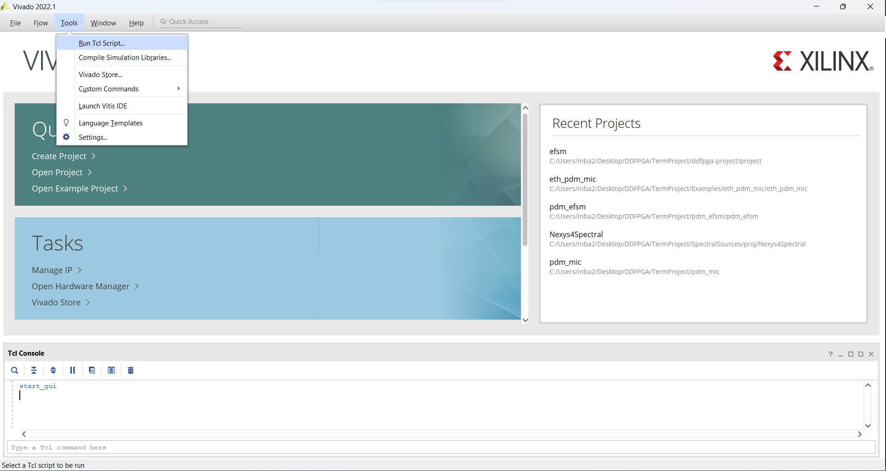
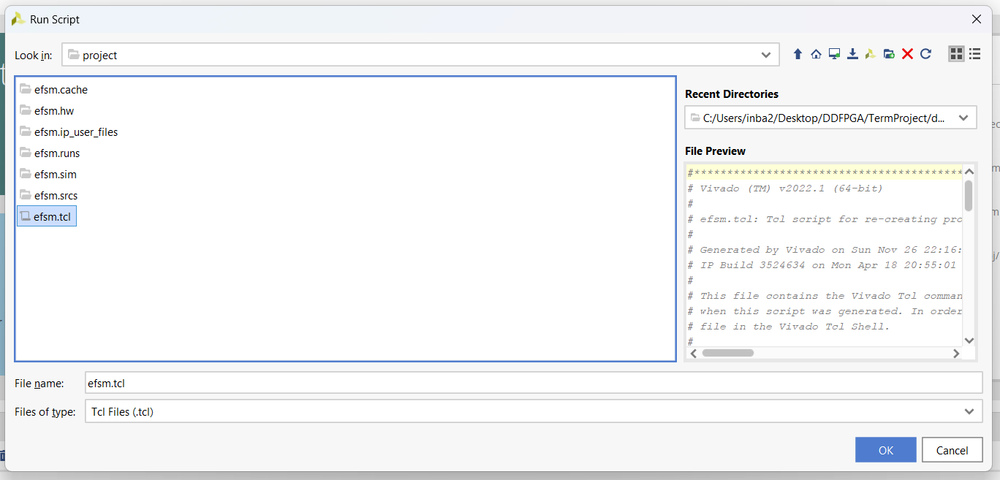
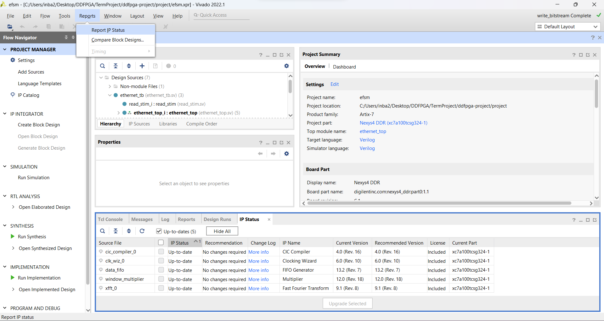
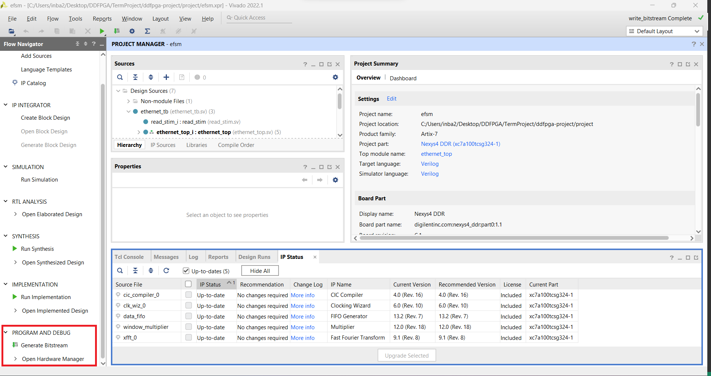
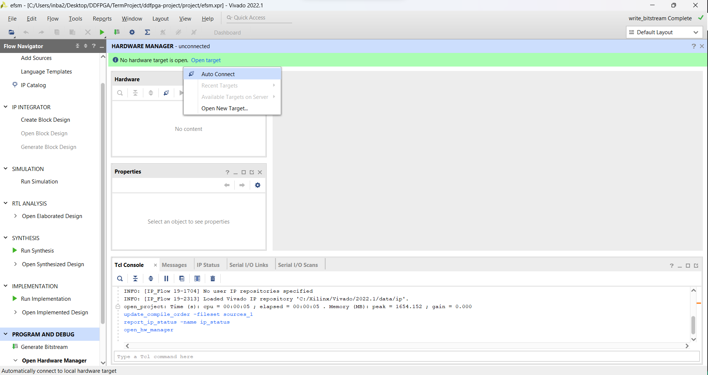
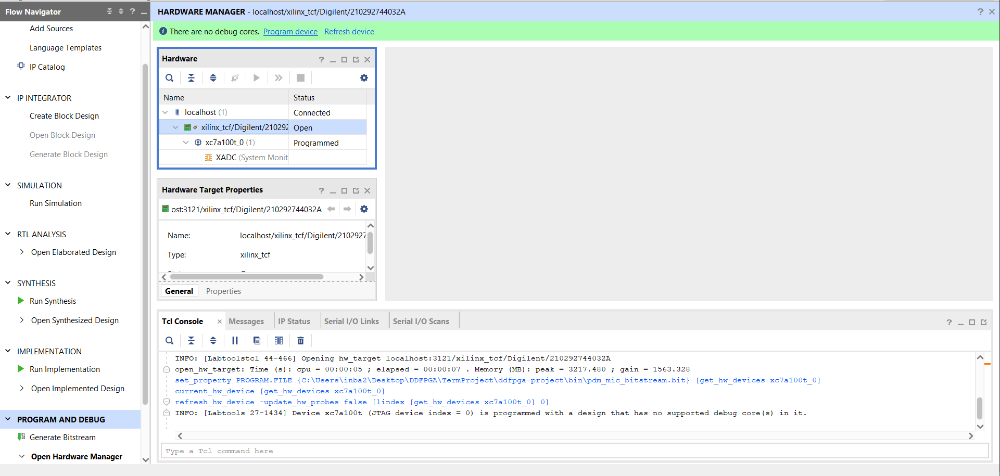

# Nexys 4 DDR PDM-MIC ETHERNET FRAME GENERATOR

## Overview

This project involves the Nexys4DDR, which processes data from a built-in microphone using Pulse Density Modulation (PDM). It includes digital filtering for decimation and resolution enhancement, as well as audio data reverberation. Additionally, it performs Fast Fourier Transform (FFT) computations over the Ethernet interface using the 100-base-T standard. The packets are captured on the host machine using `RAW_SOCKETS` and processed using various signal processing algorithms.

### Peripherals Used

- PDM microphone
- 10/100 Ethernet PHY

## Description

The Nexys4DDR acquires PDM data from the built-in microphone, applies digital filtering for decimation and resolution (16-bit, 48KSPS), and subsequently adds audio reverberation before outputting it through the built-in Audio Out interface. Following this, the machine computes the Fast Fourier Transform (FFT) of the time-domain signal and transmits it over the Ethernet. On the host side, we capture the packets using `RAW_SOCKETS` and display the real-time Fourier spectrum or play back the recorded audio signal.

## Prerequisites

### Hardware

- Nexys 4 DDR FPGA board
- Micro-USB cable
- Ethernet cable

### Software

- [Vivado Design Suite 2021.1+](https://www.xilinx.com/support/download/index.html/content/xilinx/en/downloadNav/vivado-design-tools/2022-1.html) _(Procedure may vary with other versions)_
- [Python (latest version)](https://www.python.org/downloads/)
- [Wireshark](https://www.wireshark.org/download.html)

## Setup Instructions

1. **Clone the Repository**

   ```bash
   git clone https://github.com/the-pinbo/ddfpga-project.git
   ```

2. **Generate the Project**

   - Open Vivado.
   - Click `Run Tcl Script` in the tools window. 
   - Navigate to `ddfpga-project/project` and select `efsm.tcl`. 
   - Upgrade IPs if necessary via `Reports > Report IP Status`. 
   - **Note:** Change MAC address before generating the bitstream.
     - **Linux:** Use `ifconfig -a` in terminal.
     - **Windows:** Use `ipconfig /all` in Command Prompt.

3. **Build the Project**

   - Use `Generate Bitstream` in Vivado.
   - Run Synthesis and Implementation steps.

4. **Program the Board**

   - Connect the FPGA board.
   - Use `Auto-Connect` in hardware manager. 
   - Load the program with `program device`. 

5. **Capture Packets**

   - Connect Ethernet from FPGA to computer.
   - Use [Wireshark](https://www.wireshark.org/docs/wsug_html_chunked/ChCapCapturingSection.html) for packet analysis.
   - Save packets as `.pcap` for processing.

6. **Setting Up a Virtual Environment**

   - Linux

     ```shell
     python3 -m venv venv
     source venv/bin/activate
     pip install -r requirements.txt
     ```

   - Windows

     ```shell
     python -m venv venv
     .\venv\Scripts\activate
     pip install -r requirements.txt
     ```

7. **Packet Defragmentation and Audio Generation**

   This process involves defragmenting packets and performing signal processing to generate an audio file from the captured data.

   - **Generating Audio Using Wireshark Analysis**
     Run python\wireshark_analysis.ipynb to analyze the data and generate an audio file in .wav format.
   - **Generating Audio Directly (Linux Only)**
     **Note: This method requires sudo access.**
     1. Open `python\receive_wav.py` and configure the Ethernet interface and destination MAC address.
     2. Run the `receive_wav.py` file.

8. **Play Back Audio**
   - Enjoy the processed voice through the microphone.

For detailed implementation, see [Implementation Details](report.md).
