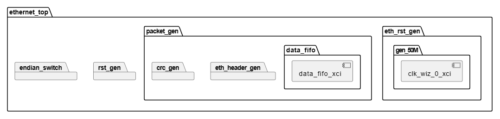
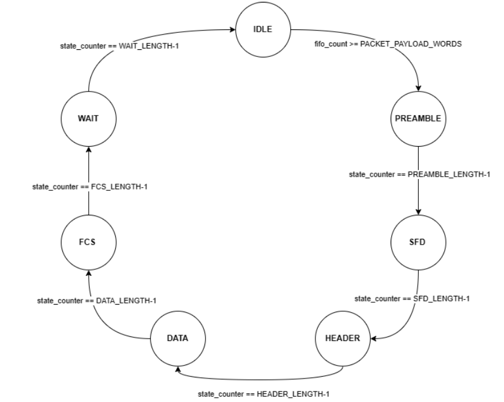

# Introduction

The \"PDM-to-Ethernet-Packet-Generator\" project represents a
comprehensive exploration into digital signal processing and network
communication on the Digilent Nexys4-DDR FPGA Development Board. The
primary objective of this project is to develop a robust system capable
of capturing audio data from the MEMS microphone integrated into the
FPGA board, processing the signal using the Fast Fourier Transform (FFT)
algorithm, and transmitting the results via the Ethernet protocol to a
host computer. This multifaceted project involved the implementation of
an Ethernet frame state machine on the FPGA, enabling seamless
communication between the embedded system and the external environment.

The project's significance lies in its integration of hardware and
software components to achieve real-time audio signal processing and
transmission. By harnessing the capabilities of the FPGA, we aimed to
demonstrate the practical application of digital signal processing
techniques in the context of audio data. The utilization of the Ethernet
protocol facilitated efficient and reliable communication between the
FPGA and the host computer, paving the way for potential applications in
audio processing and analysis.

The project covers the development of the Ethernet frame state machine,
the integration of the MEMS microphone for audio capture, the
implementation of the FFT algorithm for signal processing, and the
transmission of processed data using the Ethernet protocol. It also
involves the post-processing steps undertaken on the received data,
including packet capture using Wireshark and visualization using Python.

# Project Details

## Ethernet Frame Generation Process



This section outlines the process of generating Ethernet frames. The
generation of Ethernet frames necessitates the configuration of the
physical layer transceiver circuitry (PHY) and the development of a
controller module. The PHY plays a pivotal role as it connects the
Ethernet Media Access Control (MAC) to the physical transmission medium,
handling the fundamental Layer 1 functions of the Ethernet protocol.

### Ethernet PHY Configuration

The Ethernet frame generation is centered around the configuration of
the SMSC 10/100 Ethernet PHY integrated on the Nexys4 DDR board, which
interfaces with an RJ-45 jack featuring integrated magnetics. A pivotal
aspect of this setup is the Reduced Media Independent Interface (RMII)
configuration, where the data bus width is set to 2 for transmitting and
receiving Ethernet frames. A First-In-First-Out (FIFO) buffer manages
the efficient flow of packet data from the source (AXI stream) to the
packet generator.

The configuration of the PHY was methodically executed with the
following key steps:

- Activation of Reduced Media Independent Interface (RMII) mode to
  improve the efficiency of Ethernet connectivity.

- Implementation of auto-negotiation to facilitate support for various
  operational modes, allowing speeds up to 100 Mbps.

- Assignment of the address 00001 to the PHY, enabling unique network
  identification.

- Calibration of each clock signal to counteract skew issues, with the
  external PHY clock receiving a 45-degree phase shift in comparison
  to the Reference Clock (Ref_Clk), ensuring synchronization and
  reliability.

### Controller Architecture and State Machine

The controller is constructed around a state machine responsible for
generating the 802.3 Ethernet packet and frame structure. It encompasses several states and
transitions detailed as follows:



**IDLE State:** The default state where the system idles until it is prepared to
commence frame processing.

**PREAMBLE State:** Upon leaving the IDLE state, the system generates the Ethernet frame
preamble in the PREAMBLE state, a sequence critical for
synchronization.

**SFD State:** The Start Frame Delimiter (SFD) state succeeds the PREAMBLE state,
marking the beginning of the Ethernet frame.

**HEADER State:** After the SFD, the HEADER state is engaged to process the frame's
HEADER, which encapsulates vital control and addressing information,
including source and destination MAC addresses.

**DATA/PAYLOAD State:** The DATA state involves processing the frame's payload -- the core
message conveyed across the network. For initial testing, this
payload comprised 32-bit integers generated by an up-counter,
facilitating debugging via the Wireshark tool.

**FCS State:** Following the DATA state, the Frame Check Sequence (FCS) state
computes a checksum using a linear feedback shift register, applying
the standard CRC Ethernet function to verify data integrity.

**WAIT State:** The FCS state is succeeded by the WAIT state, which readies the
system either to revert to IDLE or to handle a new frame. This state
is instrumental in timing management and prevents premature re-entry
to the IDLE state.

Additionally, the controller architecture includes a reset feature and
an endianness switch, enabling conformity with various networking
protocols.

## PDM Microphone Audio Capture Process

The FPGA board is equipped with an ADMP421 chip, which is a
Micro-Electro-Mechanical Systems (MEMS) microphonefor. The
microphone captures audio signals and digitizes them using Pulse Density
Modulation (PDM). This process involves a Delta-sigma modulation circuit
integrated within the FPGA. PDM is a technique for representing analog
signals with a binary sequence, where the density of the pulses
correlates with the signal's amplitude.


### Microphone Digital Interface

The FPGA directly interfaces with the microphone, which outputs the PDM
signal. Our system is designed to handle the PDM signal in the following
manner:

- The PDM frequency, or the sampling frequency of the microphone,
  ranges between 1 MHz and 3.3 MHz. For our application, we have
  chosen 2.4 MHz, attainable through clock division since it is below
  the 5 MHz threshold.

- To address potential metastability issues arising from clock domain
  crossing, the design incorporates triple-registering.

- The PDM data undergoes processing by a Cascaded Integrator-Comb
  (CIC) filter. The configuration for the IP generation of the CIC
  filter is as follows

  - Five stages of integration and comb filtering.

  - A decimation factor of 64, resulting in an effective sampling
    frequency ($F_s$) of 37.5 kHz, derived from the 2.4 MHz PDM
    signal.

The FPGA is programmed to process the PDM data and convert it into Pulse
Code Modulation (PCM) data, which is a standard format for audio
signals.


### Packet Processing on the Host Machine

The process of handling Ethernet packets on the host machine is integral
to the data analysis phase. The following methodology is adopted to
capture and process the packets:

1. Initialize a RAW_SOCKET to intercept all Ethernet packets on the
   network interface.

2. Implement packet filtering based on the MAC address to isolate the
   relevant data.

3. Utilize a Python script for packet processing, which involves:

   - Defragmenting the packet data sequences.

   - Interpreting the payload as 32-bit big-endian integers.

   - Normalizing the data by subtracting the mean (DC offset) and
     scaling the amplitude to fit within a -1 to +1 range.

   - Converting the normalized data to 16-bit little-endian integers.

   - Saving the final output as a .wav audio file.

An alternative approach entails the use of packet capture software, such
as Wireshark, to acquire the packets. The collected packet data can
subsequently be processed by a script that performs the operations
mentioned earlier, thereby reconstructing the audio signal.

## Fast Fourier Transform of the PDM Audio Data

The final part of the project demonstrates a practical example of signal
processing on the audio data before transmitting it using the mechanism
developed earlier. The Fast Fourier Transform (FFT) is an algorithm used
to efficiently compute the Discrete Fourier Transform (DFT) and its
inverse. The FFT exploits symmetries and recursive divide-and-conquer
strategies to compute the Fourier transform in $O(N log N)$ time
complexity, where N is the size of the input data (refer to Figure
for the implementation overview)


### Windowing Operation using Parzen Window

When employing the FFT for frequency analysis of signals within a finite
dataset, it assumes periodicity in the time domain. The FFT treats both
the time and frequency domains as circular, connecting the endpoints of
the time waveform. In cases where the signal's period doesn't exactly
fill the acquisition time, as in real-time audio, artificial
discontinuities arise, causing spectral leakage. These spurious
high-frequency components, appearing between 0 and half the sampling
rate, are aliases of energy from other frequencies. To mitigate spectral
leakage, windowing techniques are employed. Windowing involves
multiplying the time record by a smooth, finite-length window, reducing
discontinuity effects at the sequence boundaries and providing a more
accurate representation of the signal's spectrum.

The Parzen Window is one such example of a windowing
signal. It is a fourth-order B-spline window,
defined in the time domain as follows:


$$
w_0[n]=
    \begin{cases}
        1 - 6\left(\frac{N}{L/2}\right)^2\left(1 - \frac{|n|}{L/2}\right) & \text{if } 0 \leq |n| \leq \frac{L}{4}\\
        2\left(1 - \frac{|n|}{L/2}\right)^3 & \text{if } \frac{L}{4} \leq |n| \leq \frac{L}{2}
    \end{cases}
$$

$$
w[n]= w_0[n]\left(n - \frac{N}{2}\right), 0 \leq n \leq N
$$

Here, $L = N + 1$

### FFT on the windowed data

We used the `x_fft` IP available in the Xilinx Vivado IP-Catalog to
perform a 256-point FFT on the audio data.


### Visualization of FFT at Receiver

An empty `matplotlib` figure is initialised, with the x-axis ranging
from 0 to 256 and the y-axis from 0 to 8. A function animate() is
defined, which is called repeatedly to update the plot animation. Inside
this function, the following operations are performed in a loop 16
times:

1. Data packets are received from the RAW_SOCKET.

2. An `fftshift` operation is performed on the square root of the
   absolute value of the received data, to center the data about the
   origin.

3. The computed values are updated to an accumulated average.

The real-time plot displays a two-sided Fourier spectrum, which is
symmetric about the origin. The functionality of the process is verified
by testing the module on a single-frequency sine wave obtained from a
tone generator.

# Results

## Ethernet Module Testing

### Initial Verification

The functionality of the Ethernet module was initially verified through
a 32-bit integer transmitted from our 32-bit up-counter. This process
was done to ensure the integrity of data transmission via the Ethernet
interface.

```bash
#!/bin/bash

# This script configures network interface settings for packet capturing.

# Set the path to the ethtool and ifconfig utilities
ETHTOOL=/sbin/ethtool
IFCONFIG=/sbin/ifconfig

# Define the network interface
INTERFACE=enp0s8

# Enable reception of Frame Check Sequence (FCS) for received packets
# on the network interface
$ETHTOOL -K $INTERFACE rx-fcs on

# Enable the network interface to receive all packets (including erroneous ones)
$ETHTOOL -K $INTERFACE rx-all on

# Enable promiscuous mode on the network interface to capture all network traffic
$IFCONFIG $INTERFACE promisc

# End of script
```

The provided bash script is instrumental for network packet analysis,
offering capabilities crucial for deep network traffic inspection. Here
is a brief overview of its utility:

- **FCS Reception:** By configuring the network interface to accept
  the Frame Check Sequence, the script enables detailed error analysis
  on incoming packets.

- **Receiving All Packets:** The 'rx-all' setting allows for the
  capture of all packets, inclusive of those typically discarded,
  providing a comprehensive dataset for traffic analysis.

- **Promiscuous Mode:** Enabling promiscuous mode is key for packet
  sniffing, allowing the NIC to capture all network traffic, not just
  the traffic directed to it.

### Packet Analysis and Verification

Subsequently, the accuracy of the transmitted data was validated using a
Python script. This script captured the packets and verified their
sequential incrementation, confirming the proper operation of the
module. The Verilog simulation, illustrated provides a comprehensive view of the module's behavior.


### Detailed Analysis

A more detailed analysis is presented in the figure below, where the incremental population of the
data payload is visible. This figure demonstrates the consistent
incrementation of the payload by a value of one.


### Wire Shark Capture

Lastly, showcases the Wire Shark capture of
the packet transmission. It confirms the correct matching of source and
destination MAC addresses, further validating the efficacy of our
Ethernet module.


## PDM module

### LFSR and PDM Module Verification

For the initial phase of testing the PDM module, we validated the
module's operation by generating a pseudo-random sequence with a Linear
Feedback Shift Register (LFSR).

{

### CIC Filter Accuracy Verification

The accuracy of the Cascaded Integrator-Comb (CIC) filter was assessed
by generating a test stimulus of a 2000 Hz sine wave, from which we
derived the corresponding PDM signal. The signal was captured and stored
in a test file.


### Test Bench Processing

Our test bench was configured to read the stimulus input from the
provided text file and to output the processed stimulus to a separate
text file.

{

### Output Waveform Comparison

To ensure the output stimulus corresponded with the expected output
waveform, we utilized a Python script to plot and compare the waveforms.


## Real-Time Fourier Spectrum Analysis

The real-time Fourier spectrum of the audio signal captured by the PDM
microphone is visualized on the host machine. During our demonstration, a 1 kHz sine wave was used as the
input audio. The resulting Fourier spectrum distinctly showcases peaks
at the 1 kHz mark, which verifies the accuracy of the signal processing
pipeline and the integrity of the captured audio signal.


## Synthesis and Timing Report

### Resource Utilization

The table indicates the usage of Look-Up
Tables (LUTs), Flip-Flops (FF), Block RAM (BRAM), Ultra RAM (URAM), and
Digital Signal Processing blocks (DSPs). Each module's name, the
constraints applied, and the status of the synthesis are also detailed.
Notably, the 'impl_1' module has completed synthesis and bitstream
generation, indicating a successful design implementation.


### Design Timing Summary

The timing summary, includes the worst negative slack (WNS), total negative slack (TNS), and
the number of failing endpoints for setup, hold, and pulse width
conditions. The WNS of 0.541 ns for setup conditions and the worst hold
slack (WHS) of 0.046 ns indicate the timing performance of the design. A
zero TNS and no failing endpoints for both setup and hold suggest that
the design meets the specified timing constraints.


# Conclusion

Throughout this project, we have effectively established a state machine
for Ethernet frame generation on the Digilent Nexys4-DDR FPGA Board. The
system has been configured to facilitate data transmission adhering to
the IEEE 802.3 Ethernet standard. Further, we developed a module capable
of capturing audio via the onboard MEMS PDM microphone, processing the
signal through an FFT algorithm, and subsequently transmitting the data
over Ethernet. This undertaking has showcased the harmonious integration
of signal-processing techniques with robust network communication
protocols.

In the post-processing phase, we utilized tools such as Wireshark for
packet capture and Python scripts for data visualization, which
collectively affirmed the reliability and precision of our system. The
graphical depictions of the audio signal processing substantiate the
project's effectiveness in fulfilling its objectives.

While the project's primary aims have been attained, the scope for
advancement persists. Future work could involve optimization of the FPGA
resource utilization, exploration of more complex signal processing
techniques, or the incorporation of real-time visual output on a VGA
monitor, thereby broadening the project's applicability and efficiency.

# References

\"HDLForBeginners,\" GitHub, \[Online\]. Available:
<https://github.com/HDLForBeginners/Examples>.

\"DSP series,\" YouTube, \[Online\]. Available:
<https://www.youtube.com/playlist?list=PL9K1-gZiaFsMHey5T9AnELT7DjA4fC_rn>.

\"Nexys 4 DDR Spectral Sources Demo,\" Digilent, \[Online\]. Available:
<https://digilent.com/reference/learn/programmable-logic/tutorials/nexys-4-ddr-spectral-sources-demo/start>.

\"Getting Started with MicroBlaze Servers,\" Digilent, \[Online\].
Available:
<https://digilent.com/reference/learn/programmable-logic/tutorials/nexys-4-ddr-getting-started-with-microblaze-servers/start>.

\"Nexys 4 DDR Reference Manual,\" Digilent, \[Online\]. Available:
<https://digilent.com/reference/programmable-logic/nexys-4-ddr/reference-manual>.

\"Article Title,\" DSPRelated, \[Online\]. Available:
<https://www.dsprelated.com/showarticle/1337.php>.

\"CRC Generator,\" Bues, \[Online\]. Available:
<https://bues.ch/cms/hacking/crcgen>.

\"Networking TCP/IP Model,\" Parth Shandilya, \[Online\]. Available:
<https://www.parthshandilya.com/networking-tcp-ip-model/>.

\"Ethernet Frame,\" Wikipedia, \[Online\]. Available:
<https://en.wikipedia.org/wiki/Ethernet_frame>.

\"Ethernet Frame Format Explained,\" ComputerNetworkingNotes,
\[Online\]. Available:
<https://www.computernetworkingnotes.com/ccna-study-guide/ethernet-frame-format-explained.html>.

\"LFSR and Ring Generator,\" VLSI Tutorials, \[Online\]. Available:
<https://vlsitutorials.com/lfsr-and-ring-generator/>.

\"Raw Socket Function,\" ResearchGate, \[Online\]. Available:
<https://www.researchgate.net/figure/Raw-socket-function_fig11_263617788>.

\"Parzen window impulse response,\" Recording Blogs. (n.d.).,
\[Online\]. Available:
<https://www.recordingblogs.com/rbdocs/wiki/parzenwindow-impulseresponse.png>.
:::

$$
$$
